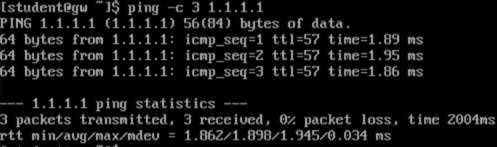
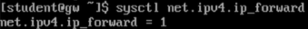
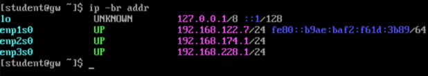
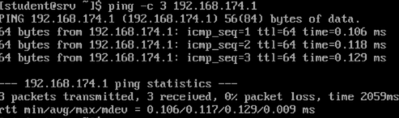

# Verification

## gw
- Hostname: `gw`
- WAN Internet test: `ping -c 3 1.1.1.1` succeeded.

	
- IPv4 forwarding: `sysctl net.ipv4.ip_forward` returned `1`.

	
- Gateway interface addresses show the configured IPv4 addresses on `gw`.

	

## srv
- Hostname: `srv`
- LAN1 address: `192.168.174.2/24`

	
- Gateway test: `ping -c 3 192.168.174.1` succeeded.

	
